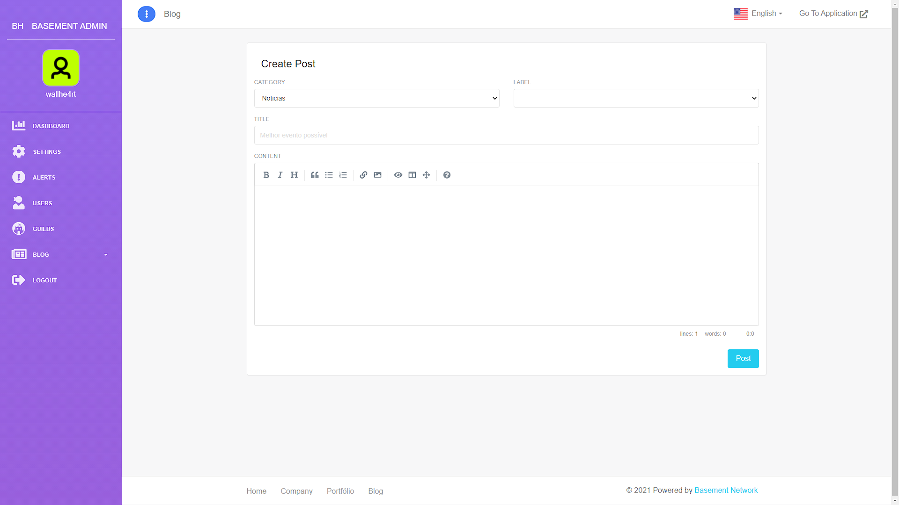
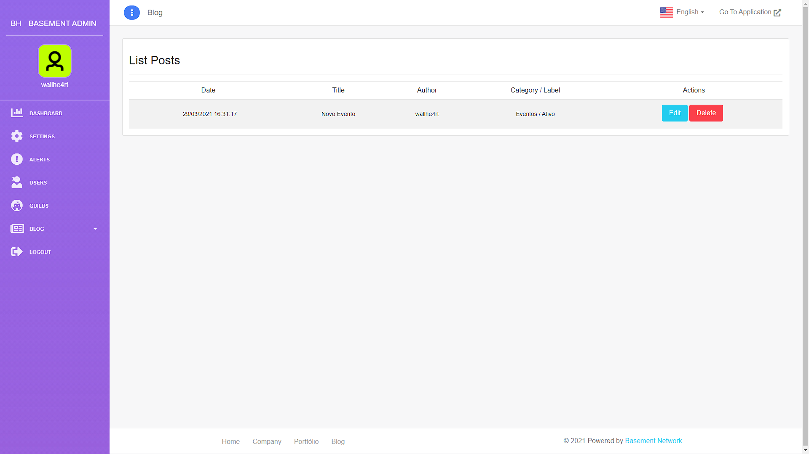
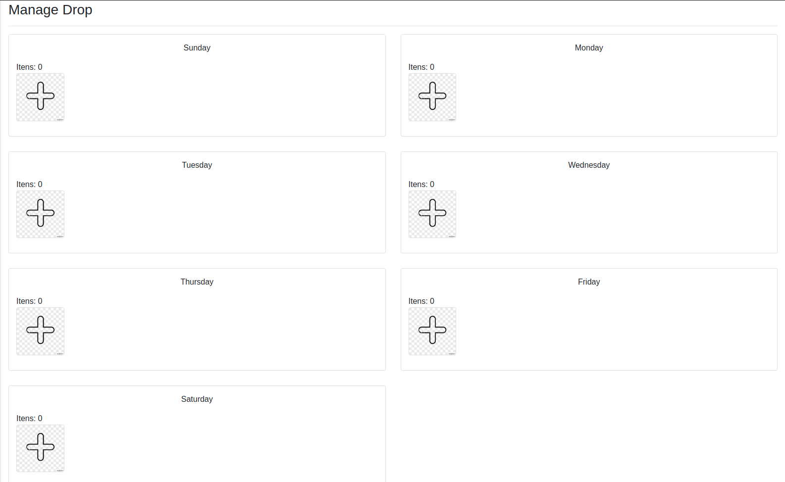
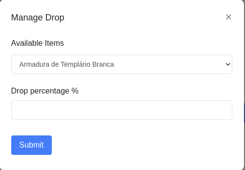

<h1 align = "center"> Dashboard </h1>  

## Blog

The Basement Heroes have a blog system that the streamer could post stuff to inform the users of the news that occurred on the game, this news can be a bug fixing, adding items, new alerts, games, etc.

To create a new post, you must login on the application Basement Heroes, go to the [Dashboard](https://basementheroes.live/dashboard). When you get into to the page you'll find the blog tab on the side menu on the left. It's a cascade menu that when you click will show the options of: create and see the posts that was cretead before.

### Creating Posts
----

When you click create a post, will open a form with the options of: category, status, title and content.

 

In the category you may chose between: events and news. Status will inform a news or event that is already occurring, will still come or has already occurred and is finalized. The field of the title is self explanatory, being intended to name the event or news. And finally, the message body is where you will explain about the event or the news that the post is about.

### Viewing posts
----

The posts can be viewed on the streamer's [main page](https://basementheroes.live/username)

When accessing, in the body of the page it is possible to view the fields Latest events and Latest news, it will be in these two fields that your posts will be made available for your users to be able to see and click to read the posts.

If you want to delete a post or edit it, just go back to your dashboard, in the same blog menu, go to View Posts and in that section will appear all the posts made by the streamer, either from events or news, ordered by date where each line will correspond to a post made. At the end of this line, he will find the posts to edit and delete, just choose the option you want, click and do what you need.

## Drop

In Basement the streamer has the possibility to drop cosmetics for his chat, from clothes to wings, all items can be set to be delivered to your user, configuring a fixed percentage for each of the items and a day of the week that each of them will be available.

For example, you can set the Gargoyle Wings to have only a 2% chance to drop on Thursday only, so everyone who is in the chat on Thursday will have a chance to get the Gargoyle Wings.

How to set up the drops

The streamer will log into the [application](https://www.basementheroes.live/) and once logged in, the streamer will need to go to the dashboard and click on the settings menu which is on the left side menu.

On this page he will see the drops configuration screen separated by day of the week. He will see that each day has its own separate section and there he can dictate which ones they are and what percentage for each one separately. That way he can set an item to be easier to find, because it is a more common item for everyone, and items that are rarer, that users need to spend more time in his chat, interacting, in order to have access to them.

He will see a + symbol, being the button he will click and it will open a small screen that will have all the items and he can configure.

On this screen, there will be a first option box where he will find all the items that are available in the system to drop. And in the second box he can type the percentage of chance he has to drop this item, being a value that must be positive and between 1 and 100.

After finishing this configuration, all he has to do is click on the submit button that will send the item and the drop of that item will already be set for that day.

This process needs to be done for each item and for each day that you want that item to be available for drop.