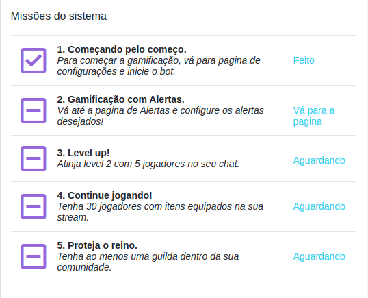

<h1 align = "center"> Instalação </h1>  

Para instalar o **Basement Heroes** na sua livestream é bem simples, só precisa entrar no site do [Basement](https://basementheroes.live/), logar com a sua twitch e depois seguir os passos que vão está descritos na dashboard.

  

Em cada opção vai ter explicando o que é para ser ativado e como vai funcionar dentro da sua live, principalmente o sistema de alertas.