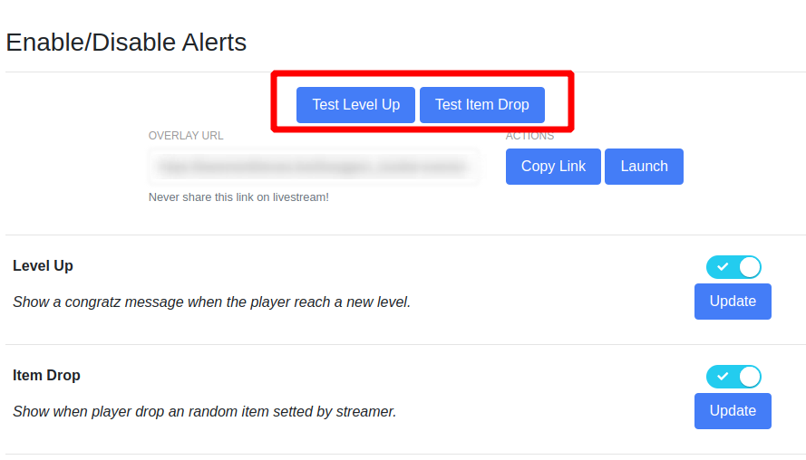

<h1 align = "center"> Installation </h1>  

How to install Basement Heroes in your livestream is pretty simple, just access our website [Basement](https://basementheroes.live/), login with your twitch and follow the steps in dashboard.

## Creating Account

To create a streamer account just access [basementheroes.live](https://basementheroes.live/) and click "Login with Twitch".

## Gamification System

Enter in "Settings" enable "Gamification System (Bot)", allowing all commands and alerts to function properly. 

## Configuring the alert

**To access the alerts remember to activate the "Gamification System (Bot)"!**

To allow alerts in your livestream. Enable "Alert System" in "Alerts" and below should be a link, copy. Activate the alerts which you want!

After have the link copied, open your OBS

Right, you already can test the alerts in your dashboard.

